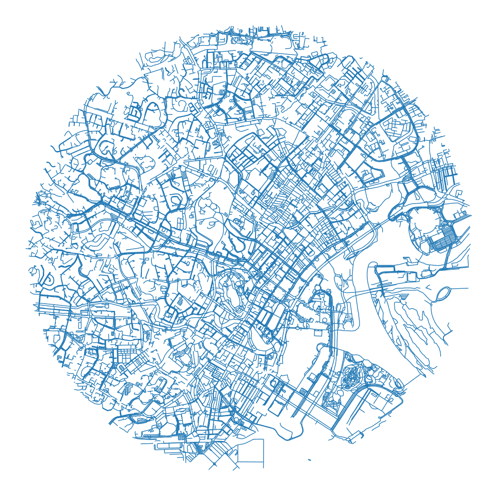

# MyWay



## Description

Mott MacDonald are delighted to present our #SmartCities Hackathon Solution “MyWay” which provides a safe solution for traversing the beautiful City of Singapore for pedestrians, improving mental health, and feeling of safety and security.

We are excited to be involved in the #SmartCities Hackathon, it resonates with our purpose “To improve society by considering social outcomes in everything we do; relentlessly focusing on excellence and digital innovation, transforming our clients' businesses, our communities and employee opportunities.” We have assembled a truly, diverse, international team to take part in the Hackathon.


## Repository Ownership

* **Practice**: Cities
* **Sector**: Digital Twins
* **Original Author(s)**: the MM team !!
* **Contact Details for Current Repository Owner(s)**: luc.jonveaux@mottmac.com

# Running the App

## Installation Instructions

The easiest way to run this code will be to use a linux environment, this has been tested on Ubuntu.

In order to successfully run the code in this respository, it is recommended that you create a virtual environment and install the required packages from the requirements.txt file provided. This can be done either through pip or conda Python package managers in the appropriate command line.

```
# For pip
> python -m venv .\venv
> venv\Scripts\activate
> pip install -r requirements.txt

# For conda
> conda create --name venv --file requirements.txt
> conda activate
```

## Notes on GDAL
A lot of the functionality in this app is based on the GDAL library.
Installing GDAL is relatively simple in certain popular Linux based environments such as Ubuntu.

```
#ubuntu commands
sudo apt install gdal-bin python-gdal python3-gdal python3-rtree
```

On windows you will need to install using this link
https://sandbox.idre.ucla.edu/sandbox/tutorials/installing-gdal-for-windows

## Running the Code

Clone the repository into a folder and activate the virtual environment or the conda environment.
Then run the following commands:
```
cd streamlit_app
streamlit run app.py
```

# Datasets Used
This project combines a number of open datasets. These are:

Dataset | Source Link
:---|:---
Master Plan 2019 Road layer|  https://data.gov.sg/dataset/master-plan-2019-road-name-layer 
Full pedestrian network from OSM | https://download.geofabrik.de/asia/malaysia-singapore-brunei.html 
CCTV | https://data.gov.sg/dataset/lta-road-camera 
Street Lighting | https://data.gov.sg/dataset/lta-lamp-post 
Trees | https://exploretrees.sg/ 
Parks | https://data.gov.sg/dataset/park-facilities

# Good Test Sites
This is a table of useful addresses for testing the feature preferences

Feature | Start Address | End Address
:---:|:---:|:---:
Avoid Stairs | The Landmark, Singapore | Smith Street, Singapore
Prioritise Trees| Masjid Sultan, Singapore | Rochor Link Bridge, Singapore
Prioritise Lighting| Masjid Sultan, Singapore | Rochor Link Bridge, Singapore
